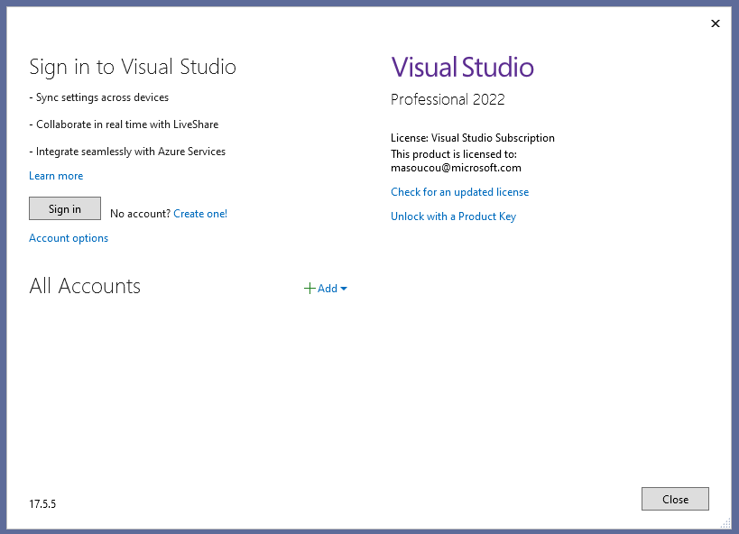
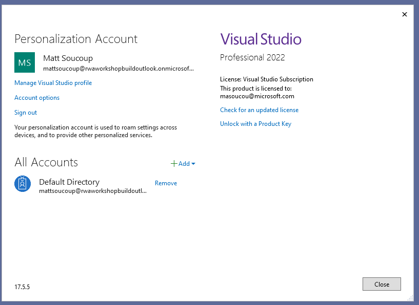
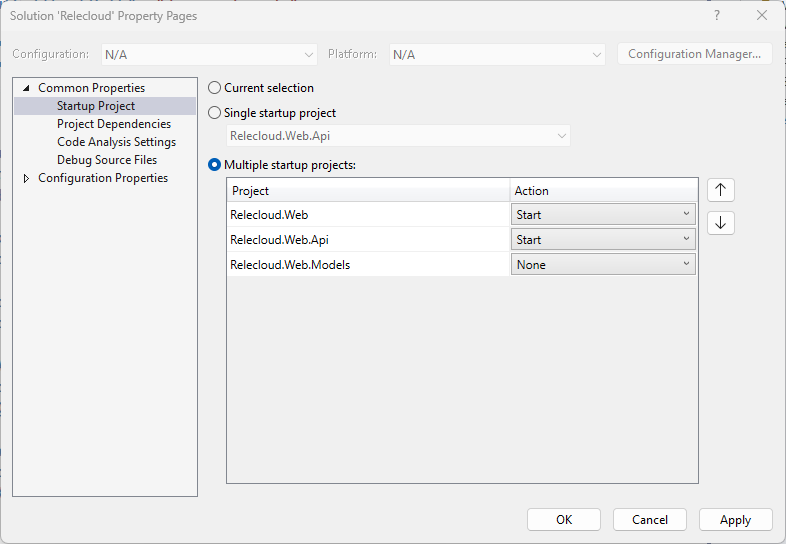

# Part 1 - Tooling Needed

Before we get into running the workshop, there are 3 things we need to set up.

- [Part 1 - Tooling Needed](#part-1---tooling-needed)
  - [Local development tooling](#local-development-tooling)
  - [Authenticating the Azure tooling](#authenticating-the-azure-tooling)
    - [Sign in to Azure from Visual Studio](#sign-in-to-azure-from-visual-studio)
    - [Authenticate the Azure CLI and Azure Developer CLI](#authenticate-the-azure-cli-and-azure-developer-cli)
    - [Clone the code](#clone-the-code)
  - [Azure Resources](#azure-resources)
    - [Local development](#local-development)

## Local development tooling

The following tools are needed to run the workshop locally:

- Windows 11
- [PowerShell 7.2 (or above)](https://learn.microsoft.com/en-us/powershell/scripting/install/installing-powershell-on-windows)
- [Git](https://github.com/git-guides/install-git)
- [Azure CLI (2.38.0 or above)](https://docs.microsoft.com/cli/azure/install-azure-cli)
- [Azure CLI Bicep extension (0.12.40 or above)](https://learn.microsoft.com/en-us/azure/azure-resource-manager/bicep/install#azure-cli)
- [Azure Developer CLI (latest)](https://learn.microsoft.com/azure/developer/azure-developer-cli/install-azd)
- [Visual Studio 2022 Community Edition (or above)](https://visualstudio.microsoft.com/vs/)
  - ASP.NET workload
  - Azure workload

If you're at Build, your machine is already pre-provisioned with all of these tools and there's nothing more you need to do.

## Authenticating the Azure tooling

Before we can start developing, we need to authenticate all of the developer tooling to Azure.

### Sign in to Azure from Visual Studio

1. Open Visual Studio.
1. Open the **File** menu and choose **Account Settings**.
1. Under the **Sign in to Visual Studio** heading, click the **Sign in** button. Use the credentials you were given for this workshop.

    

   > If you get prompted to set up Microsoft Authenticator, choose **Ask Later** and set it up when setting up the Azure CLI (below).

1. After going through the web-based authentication flow, you should see your account listed under the **Personalization Account** and **All Accounts** sections.

    

### Authenticate the Azure CLI and Azure Developer CLI

1. Open a PowerShell prompt and run the following command to authenticate the Azure CLI:

    ```powershell
    az login
    ```

    It should open a browser window and ask you to log in to Azure. Use the credentials you received from the proctor.

1. Run the following command to authenticate the Azure Developer CLI:

    ```powershell
    azd auth login
    ```

    It should open a browser window and ask you to log in to Azure. Ideally, the browser will have cached your credentials from before and you can select that account. If not, log in with the same credentials as the step above.

### Clone the code

Run the following command to clone the code to your local machine:

```powershell
git clone https://github.com/codemillmatt/rwa-build-workshop
```

And switch to the folder:

```powershell
cd rwa-build-workshop
```

## Azure Resources

As part of this workshop, we've already set up and provisioned the Azure resources for you. (If you're running through the workshop on your own, checkout these steps on how to [provision the resources](https://github.com/Azure/reliable-web-app-pattern-dotnet#steps-to-deploy-the-reference-implementation) yourself.)

The Reliable Web App Pattern contains a fully developed reference application that you can use to base your own applications on. We'll use this reference application as part of our workshop today. But first we'll need to provision and deploy the resources.

1. Switch to the **Reference App** folder:

    ```powershell
    cd "Reference App"
    ```

1. We'll use the Azure Developer CLI to deploy the code. You'll first want to create a new PowerShell environment variable and then initialize the **azd** environment.

    ```powershell
    $myEnvironmentName = '<YOUR USERNAME>'
    azd init -e $myEnvironmentName
    ```

1. Now we'll deploy the resources to Azure. This will take about 25 minutes to complete.

    ```powershell
    azd provision
    ```

    > We're going to move ahead to the **RWA Overview** lecture portion of the workshop while everybody's machine provisions. Once done, we'll come back and finish the tooling setup.

1. Because the RWA reference application uses Azure AD resources, we want to create Azure AD application client registrations for the web and API applications. Use the following command:

    ```powershell
    pwsh -c "Set-ExecutionPolicy Bypass Process; .\infra\createAppRegistrations.ps1 -g '$myEnvironmentName-rg'"
    ```

1. Finally we're ready to deploy the code. First we'll set a new **azd** environment variable and then use it to deploy the code:

   ```powershell
    azd env set AZURE_RESOURCE_GROUP "$myEnvironmentName-rg"
    azd deploy
    ```

1. Once everything is deployed, you'll be able to open the Azure portal and view your resource group. It will be named something like `<YOUR USER NAME>-rg`. From there you can open up the web application service and browse to it.

### Local development

Now let's get everything setup so you can run the RWA reference application locally. We'll need get connection strings from Azure and also make Azure firewall changes.

To connect to the database we'll use connection strings from Key Vault and App Configuration Service. Use the following script to retrieve data and store it as User Secrets on your workstation.

1. Open the Visual Studio solution `./Reference App/src/Relecloud.sln`
1. Setup the **Relecloud.Web** project User Secrets
    1. Right-click on the **Relecloud.Web** project
    2. From the context menu choose **Manage User Secrets**
    3. From a command prompt run the command:

        ```powershell
        cd "Reference App"
        pwsh -c "Set-ExecutionPolicy Bypass Process; .\infra\localDevScripts\getSecretsForLocalDev.ps1 -g '$myEnvironmentName-rg' -Web"
        ```

    4. Copy the output into the `secrets.json` file for the **Relecloud.Web** project.    
1. Setup the **Relecloud.Web.Api** project User Secrets
    1. Right-click on the **Relecloud.Web.Api** project
    2. From the context menu choose **Manage User Secrets**
    3. From a command prompt run the command

        ```powershell
        pwsh -c "Set-ExecutionPolicy Bypass Process; .\infra\localDevScripts\getSecretsForLocalDev.ps1 -g '$myEnvironmentName-rg' -Api"
        ```

    4. Copy the output into the `secrets.json` file for the 
    **Relecloud.Web.Api** project.

1. Right-click the **Relecloud** solution and pick **Configure Startup Projects...**
1. Choose **Multiple startup projects**
1. Change the dropdowns for **Relecloud.Web** and **Relecloud.Web.Api** to the action of **Start**.
1. Click **Ok** to close the popup

    

1. Add your IP address to the SQL Database firewall as an allowed connection by using the following script

    ```powershell
    pwsh -c "Set-ExecutionPolicy Bypass Process; .\infra\localDevScripts\addLocalIPToSqlFirewall.ps1 -g '$myEnvironmentName-rg'"
    ```

1. When connecting to Azure SQL database you'll connect with your Azure AD account.
Run the following command to give your Azure AD account permission to access the database.

    ```powershell
    pwsh -c "Set-ExecutionPolicy Bypass Process; .\infra\localDevScripts\makeSqlUserAccount.ps1 -g '$myEnvironmentName-rg'"
    ```

    The script will give you a warning that is about to reset the SQL admin password, press **Enter** to proceed.

1. Back in Visual Studio, open up the **File** menu and select the **Account settings...** option.
1. Under the **All Accounts** heading click **+ Add**, then choose **Microsoft**.
1. Sign in with the credentials you were given for this workshop.
1. Press **F5** to start debugging the application.

   - You may be prompted to trust the _ASP.NET Core SSL certificte_ or the _IIS Express SSL certificate_ during the first run.  Choose **Yes** to trust the certificate.

A web browser window with Swagger tooling and the website front-end should appear.

Now that the tooling is setup, let's look at how you can optimize your costs when building cloud-enabled applications in [the next module](../Part%203%20-%20Cost%20Optimization/README.md).
