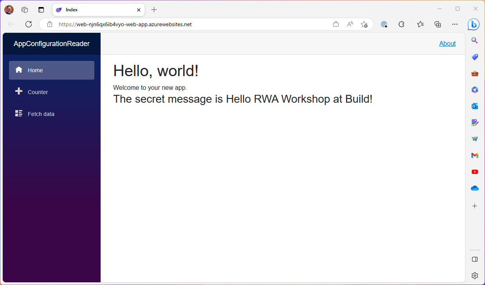
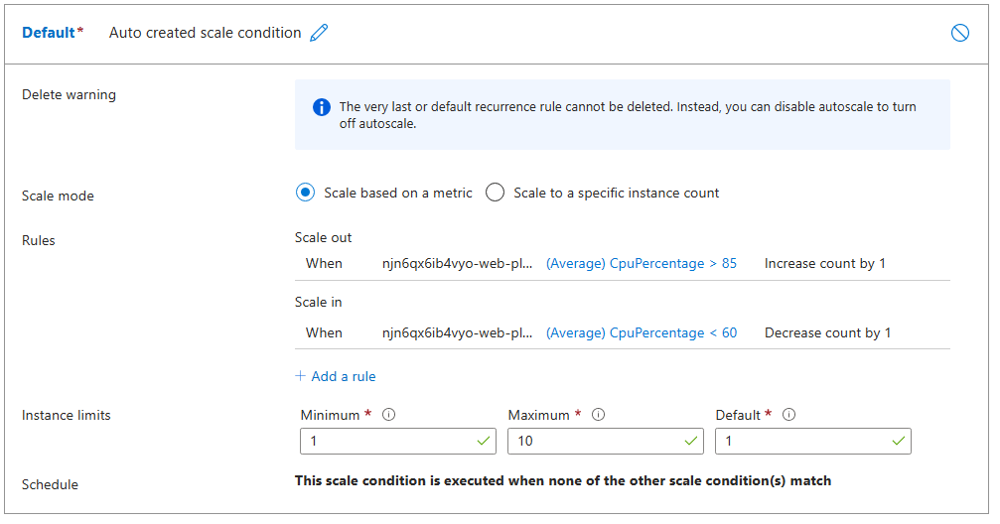

# Cost Optimization

Cost optimization principles balance business goals with budget justification to create a cost-effective web application. Cost optimization is about reducing unnecessary expenses and improving operational efficiencies.

We'll explore 4 techniques for cost optimization. Correctly sizing the resources for your business needs. Computing service-level agreements. Aiming for scalable costs. And finally, making sure to delete and cleanup what you no longer need.

In this portion of the workshop, we'll be working with a simple Blazor Server application deployed to Azure App Service that reads a value from Azure App Configuration.



## Right size resources

You can use bicep parameters to specify Azure resource deployment configurations. We'll use a small sample contained in the **Part 3 - Cost Optimization\azd-sample** directory to illustrate this technique.

1. Open a PowerShell terminal and navigate to the **Part 3 - Cost Optimization\azd-sample** directory.
1. Run the following command to initialize an Azure Developer CLI (azd) environment. _(Replace `<USERNAME>` below with the username you were given at the start of this workshop. Only use the portion before the `@` symbol.)_

    ```powershell
    $costEnvironmentName = '<USERNAME>'
    azd init -e $costEnvironmentName
    ```
1. Run the following command to set an azd environment variable. This variable will be passed into the bicep file as a parameter.

    ```powershell
    azd env set IS_PROD false
    azd env set AZURE_RESOURCE_GROUP "$costEnvironmentName-cost-rg"
    ```

1. A new directory named **.azure** has now been created under the **azd-sample** directory. It will have a subdirectory with the same name as the azd environment you created above. (For example **.azure\matt**). Within that directory will be a filed named **.env**. This file contains the environment variables you set above and needed by the Azure Developer CLI to provision the Azure resources. It should look something like the following:

  ```text
  AZURE_ENV_NAME="matt"
  AZURE_RESOURCE_GROUP="matt-cost-rg"
  IS_PROD="false"
  ```

  It also contains other environment variables needed by the Azure Developer CLI to successfully deploy the application, such as the Azure subscription ID and the Azure region to deploy to.

1. In Visual Studio or VS Code, open up the **Part 3 - Cost Optimization\azd-sample\infra** folder. This folder contains the bicep files that provision the Azure resources for this sample application.

  Variables can be used in bicep files to help provision the resources needed for particular needs. In this case we'll look at provisioning resources for production versus development.

1. Open the **main.parameters.json** file. Note that it is expecting an environment variable of the name `IS_PROD` and will map that to the bicep variable name `isProd`.

1. Now open up the **main.bicep** file. Near the top of the file, the `isProd` variable is defined as an incoming parameter. Further down, on line 35, it is passed to the **resources.bicep** file as a parameter.

1. Open the **resources.bicep** file. `isProd` again is defined as a parameter at the top of the file. On line 62, it is used to make a determination of what SKU level the Azure App Service should be provisioned at.

  ```bicep
  var appServicePlanSku = (isProd) ? 'P1v2' : 'B1'
  ```

1. Now let's provision the Azure resources and deploy the sample application. In the PowerShell terminal, make sure you're still in the **azd-sample** directory and run the following command:

    ```powershell
    azd up
    ```

    You will be prompted to pick a subscription and Azure region. You should only have one subscription option, and pick **EastUS** for the region.

2. When the provisioning and deployment is finished, the URL for the sample application will be displayed in the terminal. Open that URL in a browser. You should see the sample application running.

3. You can also view the Azure resources in the Azure portal. Open the portal and browse for resource groups. The name of the resource group will start with  **<USERNAME>-cost-rg**.

4. Open the App Service Plan within the resource group. You should see that it is provisioned with a **B1** SKU.


## Aim for scalable costs

You want to have your resources scale up and down as needed. Azure App Service has built-in autoscaling capabilities. Let's add that to our sample application.

1. In Visual Studio or VS Code, open the **autoscale.bicep** file from the **Part 3 - Cost Optimization\azd-sample\infra** folder.
1. Note how it defines scaling rules both with a trigger and an action to take when the trigger is met. For example, if the CPU percentage is greater than a threshold, increase the number of instances by 1.
1. Let's implement the autoscaling as part of our azd provisioning. Add the following to the **resources.bicep** file.

  ```bicep
  module webAppAutoScale 'autoscale.bicep' = {
    name: 'deploy-${webAppServicePlan.name}-autoscale'
    params: {
      appServicePlanName: webAppServicePlan.name
      location: location
      isProd: isProd
      tags: tags
    }
  }
  ```

1. In a PowerShell terminal, still opened to the **Part 3 - Cost Optimization\azd-sample** directory, run the following to update the azd environment.

    ```powershell
    azd env set IS_PROD true
    ```

1. Now run the following to provision the autoscaling.

    ```powershell
    azd provision
    ```

1. Now open up the same App Service Plan as before in the Azure portal (or just refresh your browser if you already have it open). You should see that it is provisioned with a **P1v2** SKU.


1. Click on **Scale out (App Service Plan)** in the left navigation. You should see that autoscaling is enabled with a "Rules Based" scale out method.  Click on **Manage rules based scaling** to see the scaling rules.



> Note: Due to limits of the free subsription, the autoscaling may not work. However, it will work if you have a paid subscription.

## Compute service level agreements

Picking the right SKU for your Azure resources based on the service level agreements (SLA) you need is another way to optimize costs. Let's look at how to compute SLAs.

Our management has decided they want a 99.98% SLA for our sample application. Let's see how we can compute the SLA for our entire app based on the Azure resources we've provisioned.

1. Our application consists of Azure App Service and Azure App Configuration.
  1. The SLA for Azure App Service is 99.95%.
  1. The SLA for Azure App Configuration is 99.9%
1. To get a composite SLA for an application composed of multiple services, multiple the SLAs together.

  ```text
  99.95% * 99.9% = 99.85%
  ```

The 99.85% SLA is not good enough for management. That's 13 hours of downtime per year! Let's see if we can improve that.

The obvious way would be to add another Azure region. If Azure resource goes down a backup in another region will be able to cover. The formula to calculate the SLA for multiple regions is:

$$ 1 - (1 - N)^R $$ 

Where **N** is the SLA for a single region and **R** is the number of regions. Let's see how that works for our sample application.

  ```
  1 - (1 - 0.9985)^2 = 99.99%
  ```

But in order for 2 regions to operate as one, you need a traffic manager or load balancer of some sort in front of them. If we use Azure Front Door, with an SLA of 99.99% we then get:

  ```
  99.99% * 99.99% = 99.98%
  ```

And that's exactly the 99.98% uptime our management wanted.

## Delete and cleanup

Of course you should tear down and delete resources you no longer need. You can do this manually in the Azure portal. Or you can use the Azure Developer CLI to do it for you.
    
Deleting the resources in the Azure portal is a matter of finding the resource you wish to delete and then clicking the **Delete** button. You can delete single, multiple, or entire resource groups.
    
    

You can also use the `azd` tooling to delete an entire provision. You would run this command from the same directory where you ran the `azd provision` or `azd up` command from:
    
    ```powershell
    azd down --force --purge --no-prompt
    ```

Now let's see how we can make our web application more resilient to failures in [Part 4 - Reliability](../Part%204%20-%20Reliability/README.md) module.
