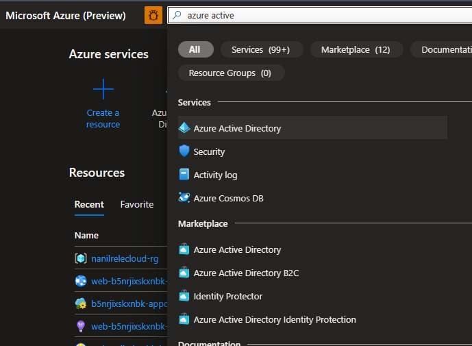
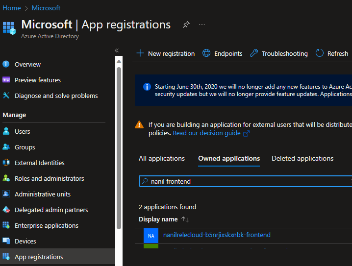
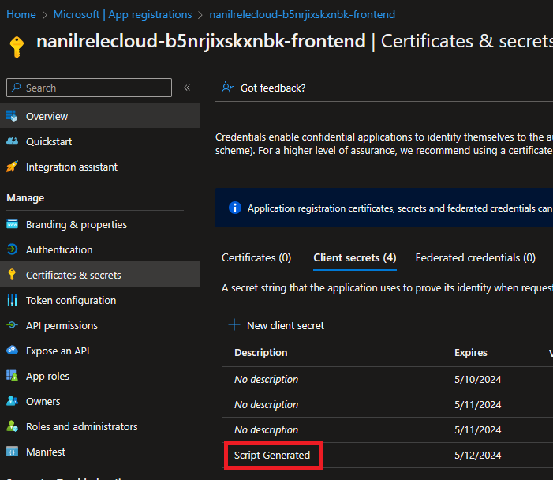
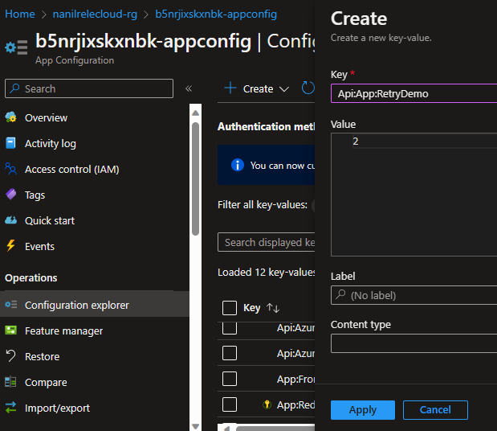
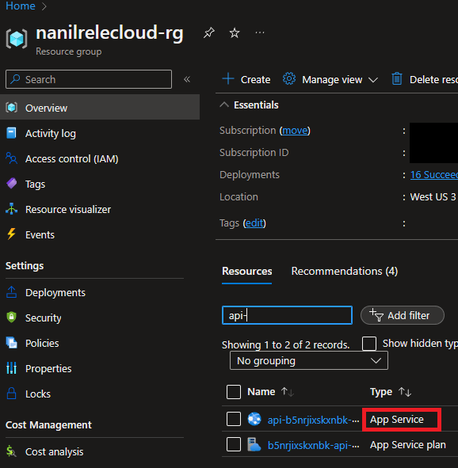
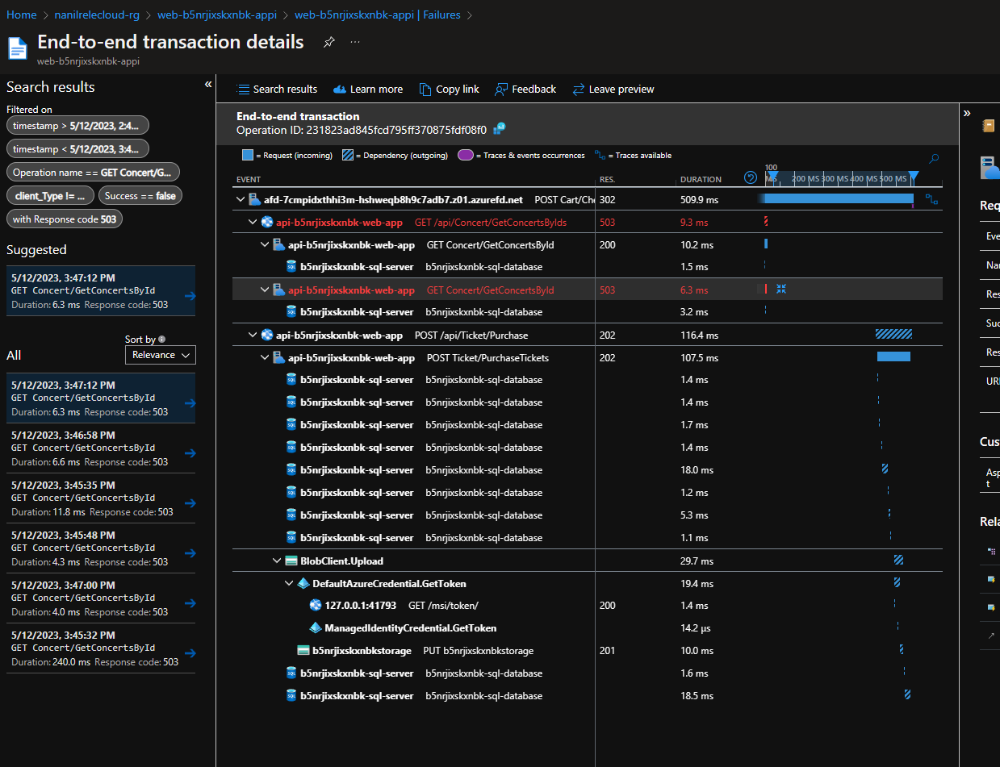

# Operational excellence

Operational excellence encompasses the procedures that ensure smooth functioning of an application in a production environment. Deployments should be both dependable and consistent. By automating these deployments, the likelihood of human error is significantly reduced. Efficient and routine deployment processes facilitate the swift release of new features and bug fixes without causing delays. Additionally, it is crucial to have the ability to rapidly roll back in case of any issues arising from a release.

## Repeatable infrastructure

Cloud computing changes the way we procure infrastructure. No longer are we unboxing, racking, and cabling physical infrastructure. We have internet accessible management portals and REST interfaces to help us. We can now provision virtual machines, databases, and other cloud services on demand and globally. When we no longer need cloud services, they can be easily deleted. As businesses move to the cloud, they need to repeatedly deploy their solutions and know that their infrastructure is in a reliable state. To meet these challenges, you can automate deployments using a practice referred to as infrastructure as code. In code, you define the infrastructure that needs to be deployed. A DevOps methodology provides a greater return on investment for application teams in the cloud. Infrastructure as Code (IaC) is a key tenet of DevOps. The reliable web app pattern requires the use of IaC to deploy application infrastructure, configure services, and set up application telemetry. 

The reference implementation uses Azure Dev CLI and IaC (Bicep templates) to create Azure resources, setup configuration, and deploy the required resources from a GitHub Action.

### Automate deployments with Bicep

Bicep is a domain-specific language (DSL) that uses declarative syntax to deploy Azure resources. Bicep provides concise syntax, reliable type safety, and support for code reuse.

You can think of Bicep as a revision to the Azure Resource Manager template (ARM template) language rather than a new language. The syntax is different, but the core functionality and runtime remain the same.

The following example shows a simple Bicep file that defines a Azure Redis Cache.

```bicep
    resource redisCache 'Microsoft.Cache/Redis@2022-05-01' = {
    name: '${resourceToken}-rediscache'
    location: location
    tags: tags
    properties: {
        redisVersion: '6.0'
        sku: {
        name: redisCacheSkuName
        family: redisCacheFamilyName
        capacity: redisCacheCapacity
        }
        enableNonSslPort: false
        publicNetworkAccess: 'Disabled'
        redisConfiguration: {
        'maxmemory-reserved': '30'
        'maxfragmentationmemory-reserved': '30'
        'maxmemory-delta': '30'
        }
    }
 }
```

## Automate operational tasks

Operational tasks encompass various actions and activities performed while managing systems, system access, and processes. Examples include rebooting servers, creating accounts, and transferring logs to a data store. Automating these tasks using scripting technologies can save time and reduce errors. In this module, we will examine the script to rotate client secrets in the Relecloud application.

## Rotating Secrets

Some services don't support managed identities, requiring the use of secrets. In such cases, externalize application configurations and store secrets in a central secret store, like Azure Key Vault, which we explored in the security module. On-premises environments often lack central secret stores, making key rotation and auditing access challenging. Key Vault enables storing secrets, rotating keys, and auditing key access, simplifying the process.

In this module, we will examine the rotation of the Azure AD Client Secret. There are various authorization processes, and to authenticate an employee within the API, the frontend web app employs an on-behalf-of flow. This flow requires an Azure AD client secret, which is stored in the Key Vault. To rotate the secret, generate a new client secret and save it to the Key Vault. In the reference implementation, restart the web app to initiate the use of the new secret. Once the web app has restarted, the previous client secret can be safely deleted by the team.

Let's execute a script to rotate Azure AD Client secret.

1. We'll use the Relecloud application deployed to your resource group during the [Tooling](../Part%202%20-%20Tooling/README.md) module. The script to execute is already in this module under the [script](./script/) directory.
1. In your command prompt navigate to the [Part 6 - Operational Excellence/script/](../Part%206%20-%20Operational%20Excellence/script/) directory.
1. Set an environment variable `$myEnvironmentName` to be the same as your username. For example, if your username is `matt-is-cool`, then run the following command:

    ```powershell
    $myEnvironmentName = 'matt-is-cool'
    ```

1. From a command prompt run the command:

    ```powershell
    pwsh -c "Set-ExecutionPolicy Bypass Process; .\ClientSecretRotation.ps1 -ResourceGroupName '$myEnvironmentName-rg'"
    ```

1. Verify that you get a similar output:
    
1. Navigate to your Azure resources in the [Azure portal](https://portal.azure.com). Open the portal and search for **Azure Active Directory** and hit return. It should take you to [Azure Active Directory Blade](https://portal.azure.com/#view/Microsoft_AAD_IAM/ActiveDirectoryMenuBlade/~/Overview)

    

1. Got to **App Registrations** under **Azure Active Directory**. Select the tab **Owned Applications** and search for your `<USERNAME> frontend` and click on `<USERNAME>-<RANDOMSTRING>-frontend`.

    

1. Wait for a few minutes. Go to the **Client Secrets** tab under **Certificates & secrets** and verify there is more than one secret and if the `Script Generated` client secret exists.

    

1. Navigate to your web app and check if everything works.

To understand the exact commands that were used to rotate the client secret, you can verify the [ClientSecretRotation.ps1](./script/ClientSecretRotation.ps1).

   > Please note that this module in the workshop highlights the significance of automating client secret rotation using scripts. In a production environment, these scripts will be incorporated into an [automated workflow](https://learn.microsoft.com/azure/key-vault/secrets/tutorial-rotation), and app downtime during web app restarts will be avoided by utilizing [deployment slots](https://learn.microsoft.com/azure/app-service/deploy-staging-slots).

## Monitoring

Monitoring operational health requires telemetry to measure security, cost, reliability, and performance gains. The cloud offers built-in features to capture telemetry. When this telemetry is fed into a DevOps framework, it can help you rapidly improve your application.

### Logging and application telemetry

Enable logging to facilitate tracing and debugging when requests fail. Ensure your application's telemetry addresses its operational requirements. At the very least, collect baseline metrics and gather user behavior data to inform targeted improvements. Follow best practices for collecting application telemetry.

**Monitor baseline metrics.** The workload should monitor baseline metrics. Important metrics to measure include request throughput, average request duration, errors, and dependency monitoring. You should use Application Insights to gather this telemetry.

*Reference implementation:* The reference implementation uses the following code to configure baseline metrics in Application Insights.

```csharp
public void ConfigureServices(IServiceCollection services)
{
   ...
   services.AddApplicationInsightsTelemetry(Configuration["App:Api:ApplicationInsights:ConnectionString"]);
   ...
}
```

#### Monitoring and investigating failures

In the [Reliability module](../Part%204%20-%20Reliability/README.md) we looked at adding resilience to the code.
In summary, a dependable web application exhibits resilience and availability. Resilience refers to a system's ability to recover from failures and maintain functionality, while availability measures user accessibility. Implementing Retry and Circuit Breaker patterns is vital for enhancing application reliability, as they introduce self-healing qualities and optimize cloud reliability features.

> Please note that in this module, we will explore monitoring resilience(Retrying failures) in production using Azure Monitoring.

We built an app configuration setting that lets you simulate and test a transient failure from the Web API. The setting is called `Api:App:RetryDemo`. We've included this configuration in the code. The `Api:App:RetryDemo` setting throws a 503 error when the end user sends an HTTP request to the web app API. `Api:App:RetryDemo` has an editable setting that determines the intervals between 503 errors. A value of 2 generates a 503 error for every other request.

Follow these steps to set up this test:

1. Go to `<USERNAME>-rg` in the Azure Portal and search for `-appconfig` in the **Resources**
    
1. Create a new key-value in App Configuration.
    - Navigate to the "Configuration explorer" by clicking the link in the left-hand blade under "Operations"
    - Click the "+ Create" button and choose "Key-value"
    - Enter the following data:

    |Name|Value|
    |-----|-----|
    |*Key*|Api:App:RetryDemo|
    |*Value*|2|

    

1. Restart the API web app App Service
    - Go to the API web app App Service (In your resource group resources, search for the app service that starts with `api-` and select the result that is of type **App Service**)

        

    - Navigate to the "Overview" blade
    - Click the "Restart" button at the top of the page.
  
    > It will take a few minutes for the App Service to restart. When it restarts, the application will use the `Api:App:RetryDemo` configuration. You need to restart the App Service any time you update a configuration value. When the value of `Api:App:RetryDemo` is 2, the first request to the application API generates a 503 error. But the retry pattern sends a second request that is successful and generates a 200 response. We recommend using the Application Insights Live Metrics features to view the HTTP responses in near real-time.
    > App Insights can up to a minute to aggregate the data it receives, and failed requests might not appear right away in the Failures view.

1. To see the **Retry Pattern** in action you can click throughout the Relecloud website and should not see any impact to the user's ability to purchase a concert ticket. However, in App Insights you should see the 503 error happens for 50% of the requests sent to the Web API.

1. Search for **Application Insights** from your resources and navigate to the **Application Maps** section. Application Map helps you spot performance bottlenecks or failure hotspots across all components of your distributed application. Each node on the map represents an application component or its dependencies and has health KPI and alerts status. You can select any component to get more detailed diagnostics, select the failing calls, and you will be able to dig through the details.

    

1. On your right side of the screen, select **Investigate Failures** and select a transaction to go through End-to-End transaction details.

    

> We recommend you cleanup by deleting the `Api:App:RetryDemo` setting.
> Please note that this module simulates an error within the code, which is not recommended in a production environment. In real-world scenarios, failures may arise when connecting to other services or third-party APIs. Application Insights provides a comprehensive overview of such interim failures while your retry code ensures your app continues to function effectively. 

#### Use Application Insights to gather custom telemetry

Supplement baseline metrics with custom telemetry to better understand your users. Utilize Application Insights for gathering custom telemetry by creating an instance of the `TelemetryClient` class and employing its methods to generate appropriate metrics.

> Note: Custom events provide valuable insights that can inform business decisions, helping you optimize user experiences and achieve your strategic goals.

The reference implementation enhances the web app with metrics that enable the operations team to confirm successful transaction completion. Instead of solely monitoring request counts or CPU usage, it verifies the web app's online status by tracking customers' ability to place orders. Using TelemetryClient through dependency injection and the TrackEvent method, the implementation gathers telemetry on cart-related events, including the addition, removal, and purchase of tickets by users.

- `AddToCart` counts how many times users add a certain ticket (ConcertID) to the cart.
- `RemoveFromCart` records tickets that users remove from the cart.
- `CheckoutCart` records an event every time a user buys a ticket.

The following code uses `this.telemetryClient.TrackEvent` to count the tickets added to the cart. It supplies the event name (AddToCart) and specifies the output (a dictionary that has the concertId and count). You should turn the query into an Azure Dashboard widget.

```csharp
this.telemetryClient.TrackEvent("AddToCart", new Dictionary<string, string> {
    { "ConcertId", concertId.ToString() },
    { "Count", count.ToString() }
});
```

You can find the telemetry from TelemetryClient in the **Azure portal**. Go to **Application Insights**. Under **Usage**, select **Events**. Click on **View More Insights** and filter by the **Event** to see the count.

Next up find out how to keep your application running fast with the [Performance Efficiency](../Part%205%20-%20Performance%20Efficiency/README.md) module.